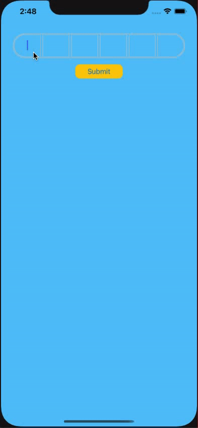

# ASOtpTextField

[](https://travis-ci.org/amitpstu1@gmail.com/ASOtpTextField)
[](https://cocoapods.org/pods/ASOtpTextField)
[](https://cocoapods.org/pods/ASOtpTextField)
[](https://cocoapods.org/pods/ASOtpTextField)

Screenshots
---------


## Example

```swift
import ASOtpTextField

class ViewController: UIViewController {
    
    @IBOutlet weak var otpField: ASOtpTextFieldViewClassic!
    
    override func viewDidLoad() {
        super.viewDidLoad()
        
        otpField
            .setField(6)
            .setInputBoxStyle(.box)
    }
    
    @IBAction func submitEventHandler(_ sender: Any) {
        let otpArray = otpField?.getTextArray()
        let otp = otpArray?.joined(separator: "")
        print("otp: \(otp ?? "")")
    }
}


```

To run the example project, clone the repo, and run `pod install` from the Example directory first.

## Requirements

## Installation

ASOtpTextField is available through [CocoaPods](https://cocoapods.org). To install
it, simply add the following line to your Podfile:

```ruby
pod 'ASOtpTextField'
```

## Author

amitpstu1@gmail.com, amitpstu1@gmail.com

## License

ASOtpTextField is available under the MIT license. See the LICENSE file for more info.
